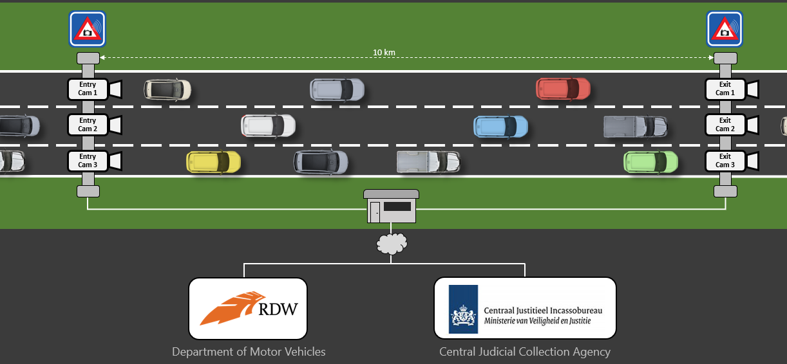
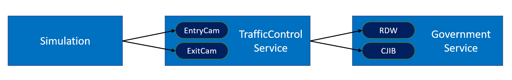
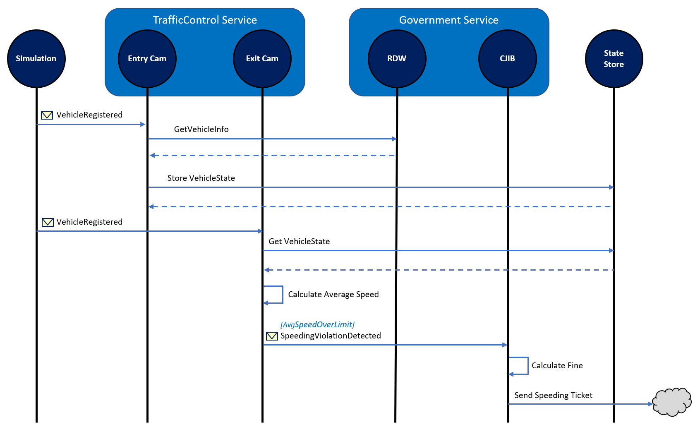
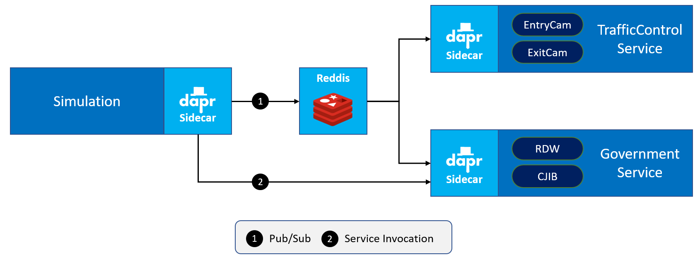

# dapr hands-on

This repository contains several hands-on assignments that will introduce you to dapr. You will start with a simple ASP.NET Core application that contains a number of services. In each assignment, you will change a part of the application so it works with dapr (or "rub some dapr on it" as Donovan Brown would say). The dapr features you will be working with are:

- Service invocation
- State-management
- Publish / Subscribe
- Secrets

For the assignments, you will be using dapr in stad-alone mode. As a stretch goal, we added a last assignment that will ask you to run the dapr application on Kubernetes.

## The domain

For the assignments you will be working with a speeding-camera setup as can be found on several Dutch highways. Over the entire stretch of a certain stretch of highway, the average speed of a vehicle is measured and if it is above the speeding limit on this highway, the driver of the vehicle receives a speeding ticket.

### Overview

This is an overview of the fictitious setup you're simulating:



There's 1 entry-camera and 1 exit-camera per lane. When a car passes an entry-camera, the license-number of the car is registered.

In the background, information about the vehicle  is retrieved from the Department Of Motor-vehicles - DMV (or RDW in Dutch) by calling their web-service.

When the car passes an exit-camera, this is registered by the system. The system then calculates the average speed of the car based on the entry- and exit-timestamp. If a speeding violation is detected, a message is sent to the Central Judicial Collection Agency - CJCA (or CJIB in Dutch) will send a speeding-ticket to the driver of the vehicle.

### Architecture

In order to simulate this in code, the following services are available:



- The **Simulation** is a .NET Core console application that will simulate passing cars.
- The **TrafficControlService** is an ASP.NET Core WebAPI application that offers 2 endpoints: *Entrycam* and *ExitCam*.
- The **Government** service is an ASP.NET Core WebAPI application that offers 2 endpoints: *RDW* (for retrieving vehicle information) and *CJIB* (for sending speeding tickets).

The way the simulation works is depicted in the sequence diagram below:



1. The **Simulation** generates a random license-number and sends a *VehicleRegistered* message (containing this license-number, a random entry-lane (1-3) and the timestamp) to the *EntryCam* endpoint of the **TrafficControlService**.
2. The **TrafficControlService** calls the *RDW* endpoint of the **GovernmentService** to retrieve the brand and model of the vehicle corresponding to the license-number.
3. The **TrafficControlService** stores the VehicleState (vehicle information and entry-timestamp) in the state-store.
4. After some random interval, the **Simulation** sends a *VehicleRegistered* message to the *ExitCam* endpoint of the **TrafficControlService** (containing the license-number generated in step 1, a random exit-lane (1-3) and the exit timestamp).
5. The **TrafficControlService** retrieves the VehicleState from the state-store.
6. The **TrafficControlService** calculates the average speed of the vehicle using the entry- and exit-timestamp.
7. If the average speed is above the speed-limit, the **TrafficControlService** will sent a *SpeedingViolationDetected* message (containing the license-number of the vehicle, the identifier of the road, the speeding-violation in KMh and the timestamp of the violation) to the *CJIB* endpoint of the **GovernmentService**.
8. The **GovernmentService** calculates the fine for the speeding-violation and simulates sending a speeding-ticket to the owner of the vehicle.

All actions described in this sequence are logged to the console during execution so you can follow the flow.

### End-state

After completing all the assignments, the architecture has been changed to work with dapr. For communicating messages, the **publish and subscribe** building-block is used. For doing request/response type communication with a service, the  **service-to-service invocation** building-block is used. And for storing the state of a vehicle, the **state management** building-block is used.



In the assignments, the Reddis component is used for both state management as well as for pub/sub.


## Getting started

### Prerequisites

Make sure you have the following prerequisites installed on your machine:

- .NET Core 3.1 ([download](https://dotnet.microsoft.com/download/dotnet-core/3.1))
- Visual Studio Code ([download](https://code.visualstudio.com/download))
- Dapr CLI 0.10.0 ([download](https://github.com/dapr/cli/releases/tag/v0.10.0))

### Instructions

Every assignment is contained in a separate branch in this repo. Each branch contains the description of the assignment that you can follow. The branch also contains the starting-point of the application as if the previous assignment was executed correctly.

Every description of an assignment contains two parts with each a certain approach to executing the assignment: a **DIY** part and a **step-by-step** part. The DIY part just states the outcome you need to achieve with a link to the dapr documentation. The step-by-step part describes exactly what you need to change in the application step-by-step. It's up to you to pick an approach. If you pick the DIY approach and get stuck, you can always go to the step-by-step approach for some help.

Now it's time for you to get your hands dirty. Checkout the first assignment branch and get started. We assume you already cloned the [repository](https://github.com/edwinvw/dapr-hands-on). Open a git command-line and check-out the branch for the first assignment:

```
git checkout assignment01
```

Now open the repository folder in VS Code. Open the README.md in the folder with you favorite MarkDown reader and follow the instructions. Have fun!